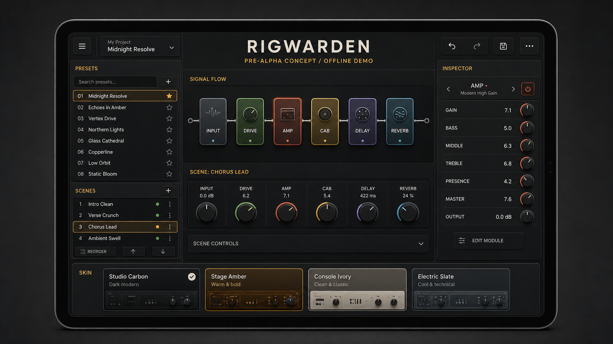
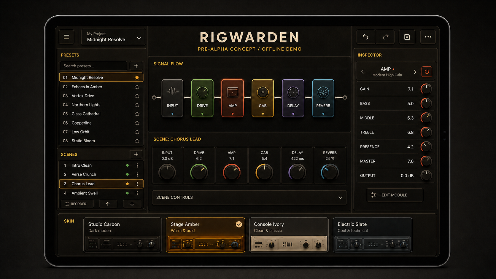
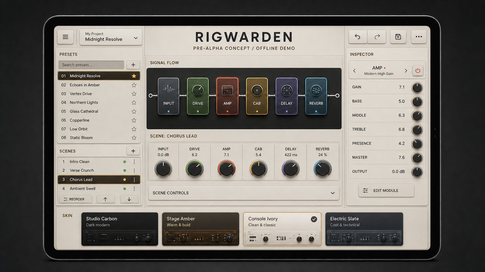
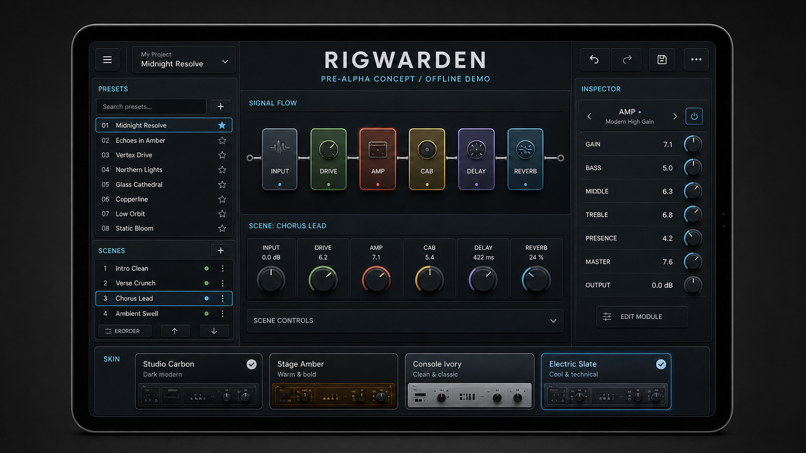

# RigWarden — pre-alpha source

**Public pre-alpha identity:** RigWarden
**Internal planning codename:** Topology (legacy documents only)
**Tagline:** *An open editor for modern modelers.*
**Kit version:** 1.0
**Prepared:** 2026-08-08

> Public identity status: `RigWarden` is approved only as a **provisional
> pre-alpha GitHub identity**. It is not legal clearance and is not approved
> for a package ID, store listing, domain, handle, or trademark claim. The
> legacy `Topology` codename remains internal. See
> [ADR-0001](docs/decisions/ADR-0001-working-name-gate.md) and
> [ADR-0003](docs/decisions/ADR-0003-rigwarden-pre-alpha-identity.md).

RigWarden is a free, local-first, open-source editor project for modern guitar modelers, beginning with Fractal Audio hardware. This repository is still **pre-alpha**: its research baseline and a minimal Rust compilation harness exist; it does not yet provide an editor, device support, or hardware verification. It is designed for a **GPT-5.6 Terra / High** parent session orchestrating tightly bounded **GPT-5.6 Luna / Max** subagents.

It contains project decisions, architecture, product requirements, strict TDD policy, subagent roles, evidence formats, schemas, an initial dependency-aware backlog, and a ready-to-paste master prompt. The only executable code today is a deliberately minimal Rust workspace harness; no product behavior is implemented.

## Start here

1. Create or open the repository that will become RigWarden.
2. Extract this kit into the repository root.
3. Read `docs/00-READING-ORDER.md`.
4. Select **GPT-5.6 Terra** with **High** reasoning for the parent Codex session.
5. Paste the contents of `START_HERE_PROMPT.md`.
6. Do not launch a large subagent wave until Codex verifies the effective child model and reasoning metadata available in the current runtime.
7. Let the orchestrator execute the initial research and bootstrap waves. Hardware- or fixture-blocked packets should be marked honestly and skipped while independent work continues.

## What is included

- `START_HERE_PROMPT.md` — the master kickoff prompt.
- `AGENTS.md` — project-wide agent instructions intended to remain at the repository root.
- `.codex/config.toml` — project-scoped subagent defaults.
- `.codex/agents/` — narrow custom agent definitions.
- `.codex/skills/enforce-topology-strict-tdd/` — binding strict-TDD skill and references.
- `docs/` — product, architecture, accessibility, protocol, governance, security, and release contracts.
- `work-items/` — executable work packets and the first implementation waves.
- `schemas/` — initial machine-readable schemas for work items, fixtures, requirements, and device packs.
- `templates/` — evidence, provenance, ADR, compatibility, and PR templates.
- `prompts/` — kickoff, continuation, hardware-capture, and wave-review prompts.
- `sources/RESEARCH_TARGETS.md` — primary references and open-source projects to audit before reuse.
- `tools/validate_starter_kit.py` — validates packet schemas, IDs, dependencies, graph acyclicity, evidence paths, and index synchronization.
- `PACKAGE_VALIDATION.md` and `MANIFEST.sha256` — package integrity report and per-file checksums.

## Visual direction — concept references only

These are generated visual references for future asset and UI work. They are
**not screenshots of working software**, and none of the controls, workflows,
or hardware support shown are implemented or verified.

| Studio Carbon | Stage Amber |
|---|---|
|  |  |

| Console Ivory | Electric Slate |
|---|---|
|  |  |

## Optional integrity check

From the repository root, run:

```bash
python tools/validate_starter_kit.py
```

The validator requires `PyYAML` and `jsonschema`. It does not execute product tests or claim hardware compatibility; it validates this planning package itself.

## Non-negotiable principles

1. **Observed TDD, not tests-after.** Production behavior begins only after a focused test has run and failed for the intended reason.
2. **No protocol guessing.** Every byte-level claim requires a published specification, provenance-approved fixture, lawful capture, or permissively licensed source with recorded attribution.
3. **No fake verification.** Simulator success is not hardware verification; a mock is not a platform integration; a screenshot is not accessibility.
4. **No architecture theater.** Create only the package, crate, module, or abstraction required by the next executable behavior.
5. **Accessibility is product behavior.** The routing canvas may never be the only way to understand or edit a preset.
6. **Local first.** No account, mandatory cloud, or project-owned AI backend.
7. **AI cannot write raw protocol data.** It proposes typed mutation plans that pass through the same deterministic validator and command engine as manual edits.
8. **Independent identity.** No Abyssal branding, copied vendor artwork, copied competitor layouts, or public feud.
9. **Community truthfulness.** Untested support is labeled experimental. Broad architecture is welcome; false compatibility claims are not.
10. **Free and open.** Original code is intended to be MIT licensed, with third-party licensing and provenance preserved precisely.

## Scope of this starter kit

The detailed, ready-to-run packets cover:

- external research and licensing;
- repository/toolchain bootstrap;
- evidence and schema validation;
- the first normalized domain model;
- device/firmware profile resolution;
- a minimal preset graph;
- deterministic mutation planning;
- persistent undo foundations;
- simulator/replay foundations;
- Flutter shell and nonvisual routing;
- Rust/Flutter boundary;
- the first AM4 and FM3 vertical-slice packets.

The complete product backlog is described in `docs/MASTER_BACKLOG_BLUEPRINT.md`. Terra must continue decomposing that blueprint into packets of the same quality before assigning later work.

## Important runtime note

Custom agent files request Luna at Max reasoning. The orchestrator must treat those settings as **requested until runtime evidence confirms the effective child configuration**. If the current Codex build does not expose or honor the requested routing, record the mismatch before launching a high-volume wave. Do not silently burn parent-model quota while claiming Luna was used.

## Naming note

RigWarden is the provisional pre-alpha GitHub identity. Before any store,
package, domain, handle, trademark, or release identity action, complete
formal clearance and the public-name gate in ADR-0003. Legacy planning
documents retain `Topology` where needed to preserve their research trail; do
not read that codename as public branding.
